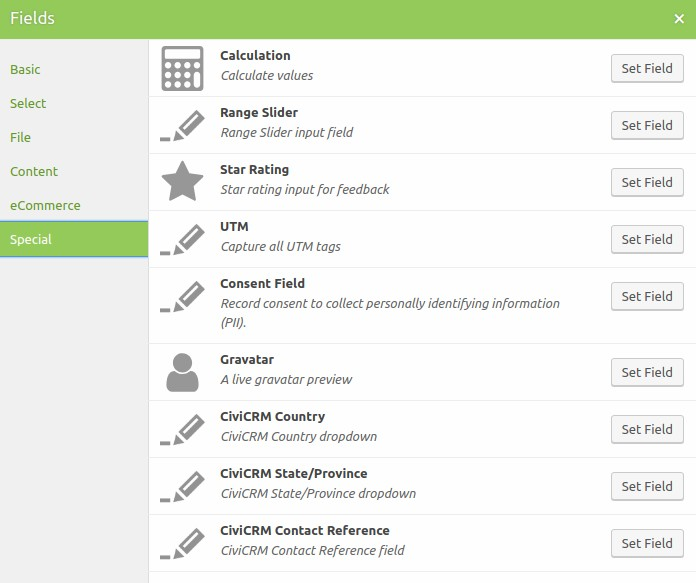
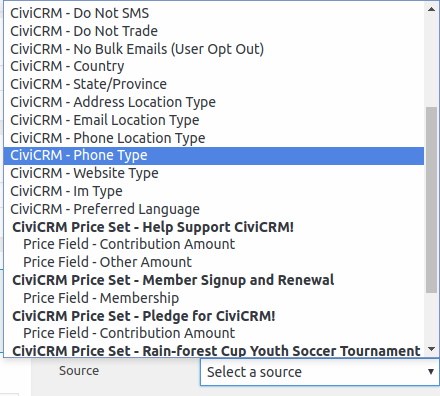
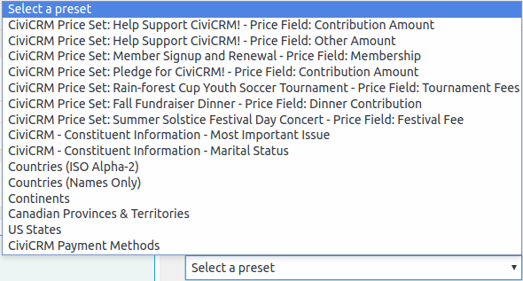
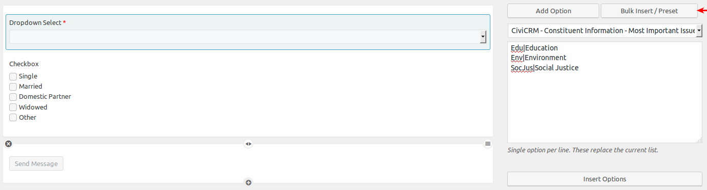
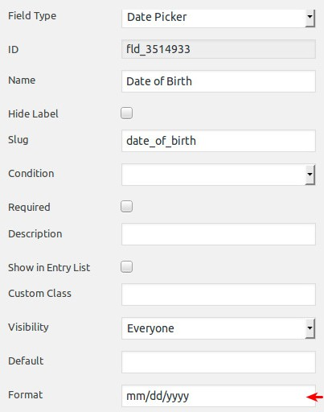
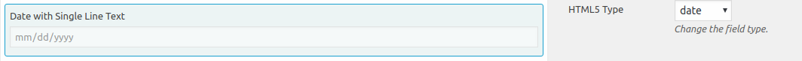

# Data fields

There are a couple  of options to be aware of when syncing data to CiviCRM. This plugin adds two Special Field Types and integrates the Select Bulk/Insert to Custom Fields created in CiviCRM

## Special fields

When adding new fields to your Caldera form there are two new options available in the Special field type:

* CiviCRM Country
* CiviCRM State/Provice
* Contact Reference
* CiviCRM Discount (with CiviDiscount installed)
* CiviCRM Premium

Similar to using a Profile form in CiviCRM, the Country field should be place prior to the State/Provide field so the correct options are displayed.

The default Country and State/Province used in the field will be taken from the settings in **Administer > Localization > Languages, Currency, Locations**

## Custom Data with Select fields

You can create custom fields in CiviCRM that are become available in the Caldera Forms integration. Custom Fields can be mapped on the [Contact](./processors.md#contact) and [Activity](./processors.md#activity) processors using [Magic Tags](./overview.md#magic-tags) field options.

The field types that currently can be used are:

* Dropdown Select
* Checkbox
* Radio
* Date Picker (also works with `Single Text Field`, HTML 5 option `Date`)

If the field doesn't exist in CiviCRM, start by creating the new custom fields in CiviCRM before adding the fields to the Caldera Form.

There are several data entities available in the Auto Populate or Bulk/Insert Presets. Some of the data options available are:

* Custom Fields
* Communication Preferences and Contact fields
* Price Set Line Items
* Payment Method Types

#### Auto Populate

With the Auto Populate option it provides a quick way to add CiviCRM data fields to a Caldera Form. There are no Caldera side changes or editing options, so it allows for forms to be setup more quickly. 

#### Bulk/Insert Presets

With using the Bulk/Insert Preset options you can bring CiviCRM data into a from and then edit within Caldera to tweak. What all **needs** to remain the same is the *Value* in Caldera, which matches the database ID in CiviCRM.

Start by adding a new field to the form and giving it a name. Then scroll down to the Bulk Insert/Preset option and select the field creating in CiviCRM you want to use and click Insert Options.

When using the Date Picker you must use the same settings that are in **Administer > Localization > Date Formats** in the **Date Input Fields** section. And adjusted by customized in **Administer > Customize Data and Screens > Date Preferences**

The Single Line Text fields has an HTML 5 Date option that can also be used.

