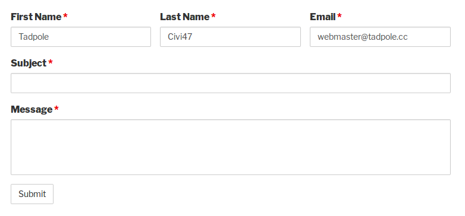
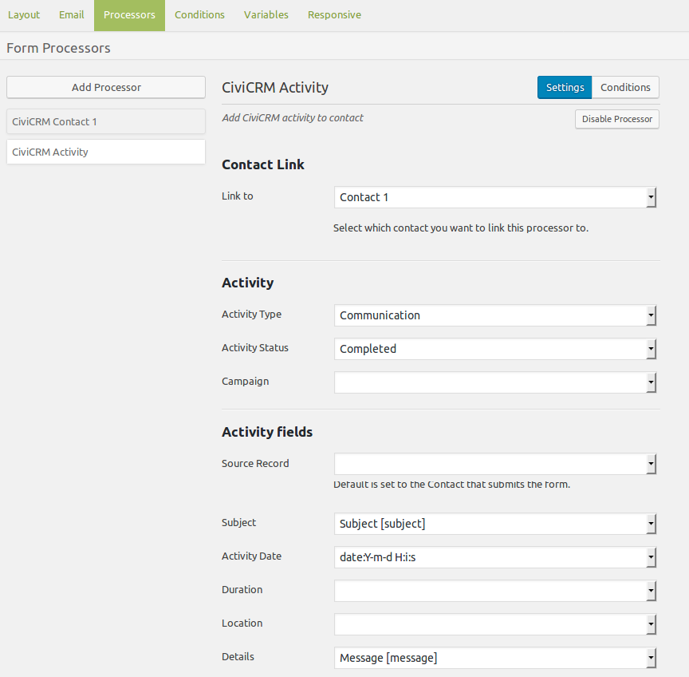

# Contact Forms

## Simple Contact Form
The contact form on your website could record an activity about this communication in CiviCRM. For this creating a custom Activity Type called Communication is useful. A simple contact form may look like this:

To get this information into CiviCRM you will need to use the [Contact](./processors.md#contact) and [Activity](./processors.md#activity) processors. The Contact processor will set the contat type, dedupe rules and the contact details in the Contact Standard Fields section. And the Activity processor will record the Subject and Message.

 

 The activity source will be the contact who filled in the form and activity date can be set with Date magic tag option and show.

