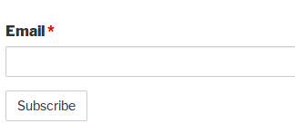
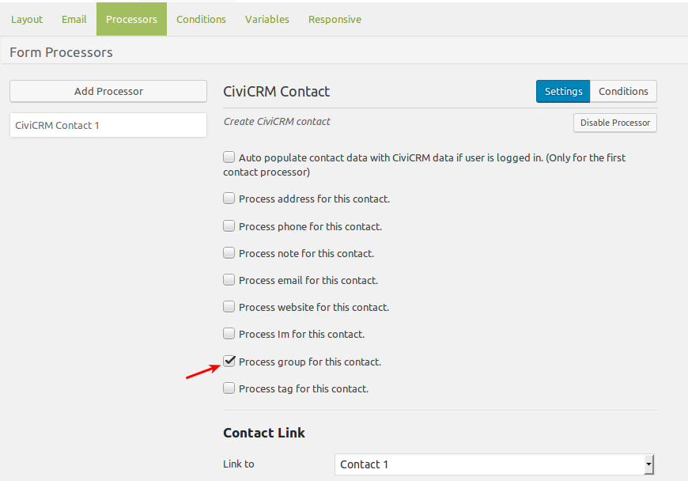
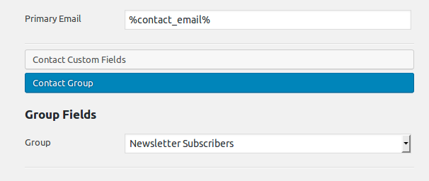
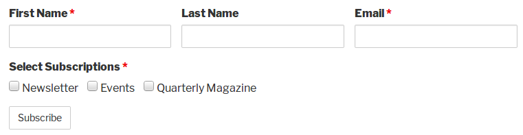
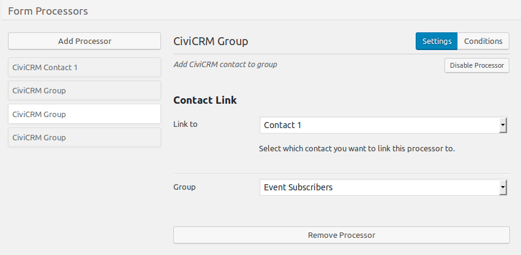
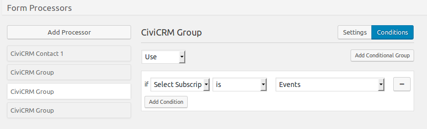
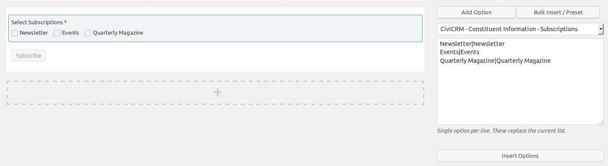
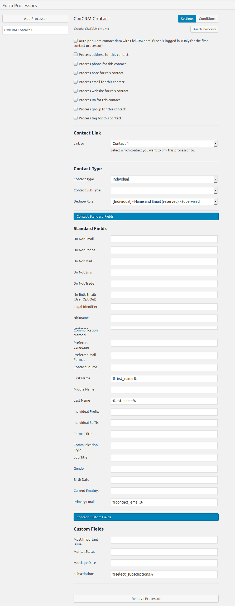

# Subscription Examples

## Simple Subscription Form

A one field form that asks for their email address and adds them to the Newsletter Subscriber group.

This form just requires one field to be added and the contact processor to be configured. Check to Process group for this contact option. After setting the Contact Type and Dedupe rules, in the Contact Standard fields add the email and select the group they should be added too.

## Multiple Subscription Groups

If your organization has multiple subscription options, where folks can select what options they receive, providing a checkboxes for them to make selections so they can be added to the right mailing group. Setup a form with the contact and subscription options set.

Then go to the Processor and add the Contact Processor. In this case we are only going to use the contact processor for contact details in the Contact Standard Fields section and use separate group processors for each selection. This way the contact will only be added to the subscription group if they select the option.

To add the contact to the right group we will use the [Group processor](../processors.md#group) and use [conditions settings](../overview.md#conditions) in each processor to manage when each is used. In this example we have three subscriptions, so three group processors should be added selecting the group they should be added too and when then setting the condition for when this processor should be used.

When complete, in this example, there should be four processors used, one for the contact and a group processor for each selection.

## Multiple Subscription Custom Fields

Another way to do this is using custom fields and then creating smart groups to create the mailing groups. To do this setup a Subscriptions custom field in CiviCRM using checkboxed and use the [Bulk/Insert Options](../custom-fields.md#bulkinsert-preset) to populate the Caldera Form.

Then go to Processors and only one processor is needed to add the magic tags to the Contact fields in the Contact Standard Fields and the Subscriptions in the Contact Custom Fields.

