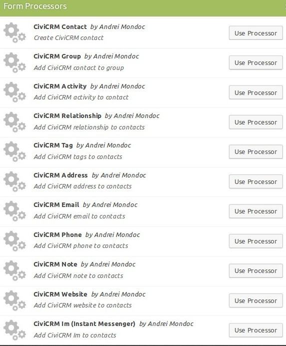
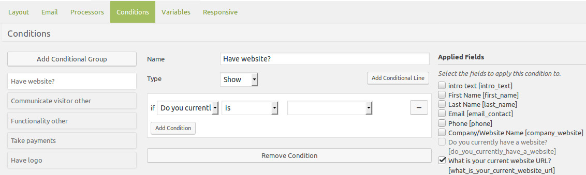
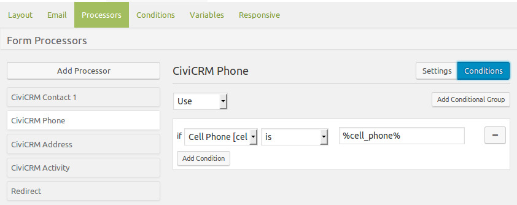
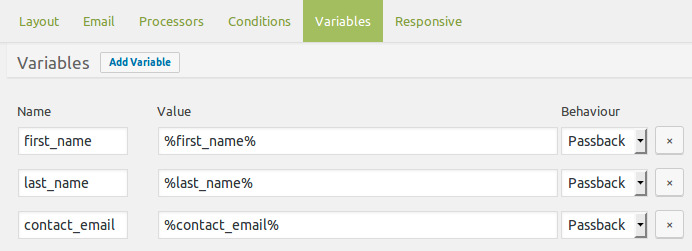
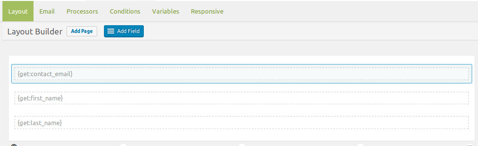

### Caldera Forms Overview

Caldera Forms uses Processors to extend what can be done with forms. By installing and activating the Caldera Forms CiviCRM plugin new processors are added to allow information from forms to be added or updated in CiviCRM.

Select and configure the processors needed for each form to send the wanted information to their CiviCRM contact record.

_To get acquainted with Caldera Forms check out their [getting started guide](https://calderaforms.com/getting-started/ "Caldera Forms Getting Started Guide")._

#### Settings

Settings are outlined in more detail in each processor see [CiviCRM Processors](/processors)

It is important to also note that processors initiate in order from top to bottom as listed underneath the “Add Processor” button and that you can drag-and-drop the order of the processors in the list.

#### Magic Tags

Magic Tags are what are used to map or sync the data fields between Caldera Forms and CiviCRM. Every field in a form has a magic tag formed with the field’s slug, which is similar the field name all lower case and with _ for the spaces. That is used with % on each side to use the magic tag. For example, if you have a Email Address field in your form with the slug `email_address` and magic tag `%email_address%`.

_For more information about this read [Using Magic Tags In Caldera Forms](https://calderaforms.com/doc/using-magic-tags-caldera-forms/ "Using Magic Tags In Caldera Forms") documentation._

#### Conditions

Fields in a form can be displayed based on conditions set. This is managed in the Conditions menu tab of that form.

Conditions are used to manage the logic used for each processor. Without adding any settings, it runs the processor each time the form is submitted. If all fields are required, no Conditions need to be set. If some fields are not required, use the Conditions to set when that processor should be used. Not doing this will cause the form to not submit. For example if you require first name, last name and email, but not phone number you would use a separate processor with a condition.

#### Variables

Variables are dynamic form values that have use in either other areas of your form or in different parts of your website. Use a static variable to hold data that you might need to use as a magic tag in some other part of the Caldera Forms Builder. Use a passback variable to send data to the next HTTP request as query variables when using the redirect proccesor. For example you can send fields from one form to another.

The variables are set in the first form simiarl to this:

And received in the second form using hidden fields like this:

_For more information about this read [Getting Started: Using Form Variables](https://calderaforms.com/doc/using-form-variables/ "Getting Started: Using Form Variables") documentation._
